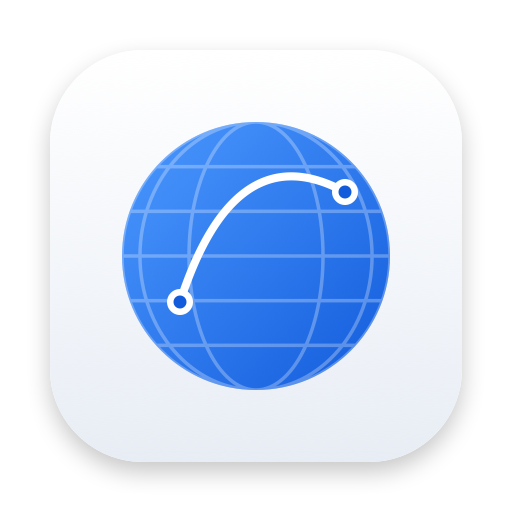

<p align="center">
  
</p>

<h1 align="center">NetLens</h1>

<p align="center">
  A native macOS app that shows everything about your network — and explains it.<br>
  ping · traceroute · netstat · DNS · ARP · ports · routing · Wi-Fi · packet capture · per-app bandwidth limits · a live 3D globe of where your traffic goes.
</p>

---

## What it does

| Screen | What you get |
| --- | --- |
| **Overview** | Your whole path to the Internet: this Mac → Wi-Fi link → router → ISP (with NAT / CGNAT detection) → backbone networks → any destination, with the latency each segment adds and how close the route is to the speed-of-light minimum. |
| **Globe** | A Metal-rendered globe of every remote host your Mac is talking to, arcs coloured by the *measured* TCP round-trip time, thickness by throughput, plus a live day/night line. Anycast addresses (servers that answer faster than light could travel to their listed location) are detected and listed separately instead of being drawn in the wrong place. |
| **Connections** | Every socket, per app, with the kernel's own TCP statistics: smoothed RTT, retransmits, windows, congestion control, service class. Traffic relayed by VPN "threat protection" proxies is credited back to the app that made it. |
| **Bandwidth** | Cap download and upload speed **per app** (e.g. keep a big Chrome download from starving your calls). Uses the kernel's dummynet shaper via a small optional helper. |
| **Listening ports** | What's accepting connections, and whether it's reachable from your network or only from this Mac. |
| **Ping** | Multi-target latency monitor with jitter, loss, a voice-call quality score (MOS), and OS/hop-distance hints from reply TTLs. Works even when your router ignores ping. |
| **Traceroute** | Parallel, mtr-style traceroute with ASN, location and reverse DNS for every hop, plus plain-English notes (Internet exchanges, long-haul links, loss that isn't real). |
| **DNS** | A `dig`-like workbench over UDP, TCP, DNS-over-TLS and DNS-over-HTTPS, DNSSEC, a resolver race, and a root-to-answer delegation walk. |
| **HTTP & TLS** | Cold-request timing waterfall (DNS, TCP, TLS, TTFB, download), HTTP/2 vs HTTP/3, certificate chain, CDN and security-header detection. |
| **Speed & quality** | Apple's `networkQuality` test with responsiveness (RPM) and bufferbloat explained. |
| **Interfaces · Wi-Fi · Routing · LAN** | 64-bit interface counters and what every `utun`/`awdl` interface is for, DHCP lease, Wi-Fi signal/noise/SNR history and a channel spectrum with a least-congested-channel suggestion, the routing table with a "which route would this take?" tool, and LAN devices from ARP/NDP, Bonjour and a subnet sweep. |
| **Packet capture** | A Wireshark-lite: BPF capture, display filters, a decoded field tree with hex view (Ethernet, ARP, IPv4/6, TCP, UDP, ICMP, DNS, TLS ClientHello SNI/ALPN, QUIC, HTTP, DHCP…), and `.pcap` export. |

Every piece of jargon has a small ⓘ next to it with a two-sentence explanation.

## Install

1. Download `NetLens-x.y.z-macOS.zip` from [Releases](../../releases) and move **NetLens.app** to Applications.
2. The release builds are not notarized (that needs a paid Apple Developer ID), so macOS will refuse the first launch. Either right-click the app → **Open** → **Open**, or run:
   ```bash
   xattr -dr com.apple.quarantine /Applications/NetLens.app
   ```

Requires **macOS 26 (Tahoe) or later**.

## Permissions — what and why

NetLens runs entirely on your Mac and only asks for what a feature needs.

| Permission | When | Why |
| --- | --- | --- |
| **Local Network** | first launch | Lets NetLens see your router (MAC address, NAT-PMP), Bonjour devices and the ARP table. macOS hides all of these otherwise. |
| **Location** | only if you click *Show network name* | macOS reveals the Wi-Fi network name (SSID) only to apps with Location access. NetLens never reads or stores your location. |
| **Administrator password** | only if you enable bandwidth caps or packet capture | Installs a small helper (`/Library/PrivilegedHelperTools/app.netlens.shaper`) — see below. |

### Network requests NetLens makes

- **ip-api.com** — public IP addresses of hosts you connect to are sent here to look up city, network operator and ASN (for the globe and traceroute). Private and local addresses never leave your Mac. Results are cached for 7 days. You can turn this off in **Settings**.
- **ipify.org** — to learn your public IPv4/IPv6 address.
- **Apple Maps** — on first use of the globe, a set of map snapshots is rendered *on your Mac* to work out where the land is (about 25 seconds, once). The result is cached locally; no map data ships with the app.
- Anything you explicitly ask for: pings, traces, DNS queries, HTTP requests, speed tests.

### The privileged helper

Bandwidth caps need the kernel's packet scheduler, and packet capture needs `/dev/bpf*` — both require root. The helper is deliberately tiny ([`ShaperHelper/main.swift`](ShaperHelper/main.swift)):

- It listens on a Unix socket and only accepts connections from the user who installed it (checked with `getpeereid`).
- It accepts only validated integers (port numbers, rates, ids) — never shell text — and turns them into `dnctl` pipes and `pfctl` rules in its own anchor (`com.apple/250.NetLensShaper`).
- If NetLens stops checking in for 30 seconds, the helper removes every limit, so a crashed app can never leave you throttled.
- For capture it opens a BPF device and passes the file descriptor back over the socket; it keeps nothing.
- Uninstall from the Bandwidth tab, or: `sudo launchctl bootout system/app.netlens.shaper && sudo rm /Library/LaunchDaemons/app.netlens.shaper.plist /Library/PrivilegedHelperTools/app.netlens.shaper`.

## Build from source

Requirements: Xcode 26+ and [XcodeGen](https://github.com/yonaskolb/XcodeGen).

```bash
brew install xcodegen
git clone https://github.com/AdityaK2128/NetLens.git
cd NetLens
./scripts/run.sh            # build (Debug) and launch
CONFIG=Release ./scripts/build.sh
./scripts/package.sh        # Release build zipped into dist/
```

`NetLens.xcodeproj` is generated from `project.yml`; open it in Xcode after running `xcodegen` (the scripts do this for you).

Builds are ad-hoc signed by default, which means macOS treats every rebuild as a new app and asks for permissions again. To avoid that during development, copy `scripts/signing.local.example` to `scripts/signing.local` and set your own team ID (the file is git-ignored).

## How it works

NetLens uses only public macOS facilities and the command-line tools that ship with every Mac — no kernel extensions, no private frameworks.

| Data | Source |
| --- | --- |
| Per-socket stats (RTT, bytes, retransmits) | `nettop` (the kernel's network statistics) |
| Ping & traceroute | unprivileged ICMP sockets (`SOCK_DGRAM` + `IPPROTO_ICMP`), TTL-limited probes |
| Interfaces & counters | `getifaddrs`, `sysctl(NET_RT_IFLIST2)` 64-bit counters, SystemConfiguration |
| Network changes, DNS servers, proxies | `SCDynamicStore` |
| Wi-Fi | CoreWLAN |
| DNS | a built-in RFC 1035 / EDNS / DNSSEC / SVCB codec over BSD sockets and Network.framework |
| HTTP timing & certificates | `URLSessionTaskMetrics`, `SecTrust` |
| Routes, ARP, NDP, DHCP, speed test | `netstat`, `route`, `arp`, `ndp`, `ipconfig`, `networkQuality` |
| Bandwidth caps | dummynet (`dnctl`) + `pf` via the helper |
| Packet capture | BPF (`/dev/bpf*`) |
| Globe | Metal, shaders compiled at runtime from [`GlobeShaders.msl`](NetLens/Features/Globe/GlobeShaders.msl) |

```
NetLens/
  App/        app entry, navigation, shared model
  Core/       engines: ICMP, traceroute, nettop monitor, DNS, GeoIP, capture, shaper client…
  Design/     design system (native, semantic colours) and the glossary behind every ⓘ
  Features/   one folder per screen
ShaperHelper/ the privileged helper
scripts/      build, run, package, icon
```

## Contributing

Issues and pull requests are welcome. Please keep the UI native and quiet — system colours, SF Pro, no decorative effects — and add a glossary entry when you introduce a new term.

## License

[MIT](LICENSE)
